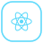
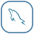
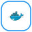
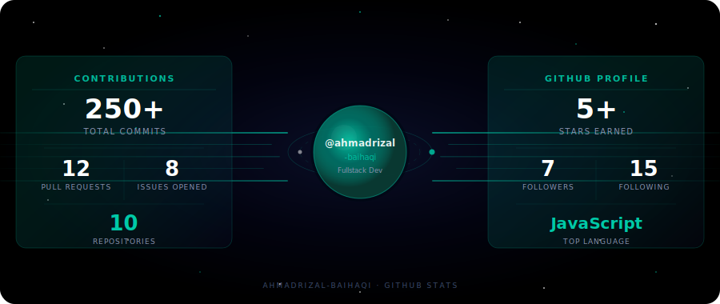

  <h1>Kode jalan, kopi habis, repeat. ☕⚡</h1>
  
<i>Welcome to my space! I'm Ahmad Rizal Baihaqi — or just call me Rizal.</i>

---

## 👨‍💻 About Me

Bukan sekadar menulis baris kode, saya adalah seorang **Fullstack Developer Enthusiast** yang antusias mengubah ide-ide menjadi solusi digital nyata. Buat saya, *ngoding* itu bukan cuma soal bikin program jalan, tapi merancang pengalaman *user* yang *seamless* dan berkarakter. Kalau lagi nggak *nge-bug*, kemungkinan besar saya lagi ngopi atau *brainstorming* project seru selanjutnya! *Let's build something awesome together!*

 

## 🛠️ Tech Stack

**Frontend**

&nbsp;&nbsp;
&nbsp;&nbsp;
&nbsp;&nbsp;
&nbsp;&nbsp;
&nbsp;&nbsp;
&nbsp;&nbsp;
&nbsp;&nbsp;
&nbsp;&nbsp;

**Backend & Database**

&nbsp;&nbsp;
&nbsp;&nbsp;
&nbsp;&nbsp;
&nbsp;&nbsp;
&nbsp;&nbsp;
&nbsp;&nbsp;

**Tools & Platforms**

&nbsp;&nbsp;
&nbsp;&nbsp;
&nbsp;&nbsp;
&nbsp;&nbsp;
&nbsp;&nbsp;
&nbsp;&nbsp;

 

## 🚀 Featured Projects

### 🌤️ [Weather Web](https://github.com/ahmadrizal-baihaqi/WeathWeb-)

Aplikasi ramalan cuaca interaktif yang menyajikan data cuaca *real-time* secara akurat dengan antarmuka yang bersih dan responsif.

> **Stack:** TypeScript, React, TailwindCSS, OpenWeather API

---

### 🔒 [Cert-Vault](https://github.com/ahmadrizal-baihaqi/Cert-Vault)

Sistem penyimpanan digital yang aman untuk mengelola, mengarsipkan, dan memverifikasi sertifikat secara terpusat dan terorganisir.

> **Stack:** React, Node.js, Express.js, MySQL

---

### 📚 [Libera — Digital Library](https://github.com/ahmadrizal-baihaqi/ukk-perpustakaan)

Platform perpustakaan digital terintegrasi dengan *Role-Based Access Control*, kalkulasi denda otomatis, dan manajemen koleksi buku yang lengkap.

> **Stack:** React, Vite, TailwindCSS, Express.js, MySQL

 

## 📊 Github Stats

  

 

## 🤝 Let's Connect

---

  <i>Kode jalan, kopi habis, proyek selanjutnya sudah antri. ☕✨</i>

