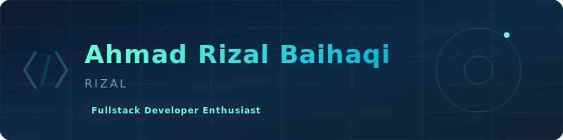

  <!-- Custom Sleek Header SVG -->
  

 

---

## 👨‍💻 Tentang Saya

Halo! Saya **Ahmad Rizal Baihaqi**, biasa dipanggil **Rizal**. Sebagai seorang **Fullstack Developer Enthusiast**, saya memiliki passion besar dalam merancang dan membangun aplikasi web yang interaktif, bersih, dan berkinerja tinggi. Bagi saya, pemrograman adalah seni memecahkan masalah nyata lewat baris kode yang efisien dan desain antarmuka yang intuitif.

Saya selalu bersemangat untuk mempelajari teknologi baru, berkolaborasi dalam proyek-proyek menantang, dan mengubah konsep kreatif menjadi produk digital yang bernilai. Di luar urusan koding dan menelusuri bug, saya biasanya mengisi waktu dengan mencari inspirasi baru, mengulik setup teknologi terbaru, atau sekadar menikmati secangkir kopi hangat. *Let's connect and build something extraordinary!*

 

## 🛠️ Tech Stack

### 💻 Frontend

### ⚙️ Backend & Database

### 🔧 Tools & Platforms

 

## 🚀 Proyek Unggulan

Dengan menggunakan pendekatan modern, berikut adalah beberapa proyek utama yang telah saya bangun:

<table width="100%">
  <tr>
    <td width="33%" valign="top">
      <h3>🌤️ Weather Web</h3>
      
Aplikasi ramalan cuaca interaktif yang menyajikan data cuaca real-time secara akurat dengan antarmuka responsif.

      

        
      

    </td>
    <td width="33%" valign="top">
      <h3>🔒 Cert-Vault</h3>
      
Sistem penyimpanan digital yang aman untuk mengelola, mengarsipkan, dan memverifikasi sertifikat secara terpusat.

      

        
      

    </td>
    <td width="33%" valign="top">
      <h3>📚 Libera Library</h3>
      
Platform perpustakaan digital terintegrasi untuk mempermudah pencarian, peminjaman, dan sirkulasi buku secara cepat.

      

        
      

    </td>
  </tr>
</table>

 

## 📊 Statistik GitHub

  <table width="100%" border="0" cellspacing="0" cellpadding="0">
    <tr>
      <td width="50%" align="center" valign="top">
        
      </td>
      <td width="50%" align="center" valign="top">
        
      </td>
    </tr>
    <tr>
      <td colspan="2" align="center" style="padding-top: 15px;">
        
      </td>
    </tr>
  </table>

 

## 🤝 Hubungi Saya

Mari berdiskusi tentang pengembangan web, kolaborasi proyek, atau sekadar bertukar pikiran!

